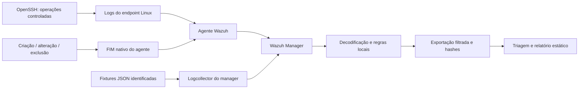

# SOC Home Lab

[](https://documentation.wazuh.com/current/)

[](https://github.com/amchdd/soc-homelab/actions/workflows/lab-verify.yml)

Laboratório de detecção e triagem SOC N1 com **endpoint Linux, agente Wazuh, autenticação OpenSSH e integridade de arquivos**. Reúne operações reais controladas, fixtures identificadas e regressão no motor, com evidências exportadas e um relatório estático.

**Versão de portfólio com escopo fechado.** Os resultados podem ser lidos sem instalar Docker ou manter um serviço em execução.

[Relatório de triagem](evidence/triage.md) · [Relatório visual — baixar e abrir](evidence/report.html) · [Manifesto e hashes](evidence/manifest.json) · [Resultados de regressão](evidence/rule-tests.json)

## O que o projeto demonstra

- Coleta de logs OpenSSH pelo agente e envio ao manager pelo canal Wazuh.
- Falhas de senha SSH, correlação por IP e login autorizado posterior como contexto de investigação.
- FIM nativo no endpoint: criação, modificação e exclusão, com comparação dos hashes.
- Regras sobre fixtures JSON de autenticação e PowerShell, com controles negativos.
- Filtragem por execução, origem, ativo e regra; rejeição de evidência antiga, incompleta ou corrompida.
- Triagem com hipóteses alternativas, prioridade operacional, lacunas e critérios de escalonamento.

Não há bloqueio automático, endpoint Windows/Sysmon, indexer ou dashboard nesta versão. O relatório HTML é um arquivo estático, não uma interface do Wazuh.

## Arquitetura



Os contêineres usam uma rede interna, sem portas publicadas, modo privilegiado, acesso ao Docker socket ou montagem de diretórios pessoais. O SSH escuta somente em **127.0.0.1 dentro do endpoint**. As senhas do exercício são temporárias e não entram nas evidências.

## Cenários e origem dos dados

| Cenário | Origem | Regras | O que validar |
|---|---|---|---|
| AUTH-SSH | OpenSSH real em contêiner | 100110, 100111, 100112 | Oito erros de senha, correlação e um login autorizado |
| FIM-001 | Operações reais em arquivos do exercício | 100105, 100113, 100114 | Alteração, criação, exclusão e hashes |
| AUTH-JSON | Fixture sintética | 100101, 100102 | Falha isolada, correlação por IP e isolamento entre execuções |
| PROC-001 | Fixture sintética de processo | 100103 | PowerShell/pwsh com opção de codificação e controles benignos |

Os logs SSH são produzidos pelo serviço; não são linhas fabricadas para a coleta. Os eventos JSON permanecem marcados com `origin=synthetic`, `run_id` e `event_id`. **Nenhum comando PowerShell é executado.** Esses exercícios são autorizados e não representam incidentes ou experiência profissional em SOC.

O nível de uma regra não define, sozinho, a prioridade operacional. Um login após falhas precisa de contexto; um comando codificado pode ser administrativo; uma alteração de arquivo pode ter autorização. Os [playbooks](docs/playbooks.md) explicam a decisão e o escalonamento.

## Verificação e evidências

A versão contém **18 casos no motor Wazuh** e **12 testes das ferramentas Python**. Os controles incluem aplicações e origens fora do escopo, processo e opção semelhantes, IPs distintos e execuções distintas. A cobertura de ponta a ponta exige as nove regras previstas.

| Critério | Snapshot de referência |
|---|---|
| Regressão no motor | 18/18 casos aprovados |
| Ferramentas de evidência e relatório | 12/12 testes aprovados |
| Cobertura de regras | 9/9 regras previstas observadas |
| Coleta de ponta a ponta | 21 alertas filtrados da mesma execução |
| Autenticação SSH | 8 falhas e 1 login autorizado nos logs nativos |
| Integridade de arquivos | Criação, alteração e exclusão com hashes conferidos |

Esses números descrevem o snapshot versionado, não um benchmark de produção. Novas execuções são aprovadas pela origem, integridade e cobertura das evidências; a quantidade de alertas pode variar. A [verificação da versão](docs/verification.md) documenta os critérios completos.

| Arquivo | Finalidade |
|---|---|
| [alerts.jsonl](evidence/alerts.jsonl) | Alertas do manager, com origem preservada e telemetria limitada ao laboratório |
| [ssh-auth.log](evidence/ssh-auth.log) | Logs nativos dos oito erros de senha e do login autorizado |
| [fim-changes.json](evidence/fim-changes.json) | Caminhos e hashes esperados das operações FIM |
| [rule-tests.json](evidence/rule-tests.json) | Casos, regras observadas e saída real do motor |
| [manifest.json](evidence/manifest.json) | Versões, imagens, identificação da execução e hashes |
| [triage.md](evidence/triage.md) / [report.html](evidence/report.html) | Análise, cobertura e linha do tempo |

SHA-256 permite conferir integridade; não constitui assinatura digital ou comprovação independente da origem. Em exclusões, o Wazuh 4.14.8 guarda o último hash conhecido em `sha256_after`; o evento `deleted` indica que o arquivo foi removido.

## Como interpretar os resultados

| Sinal | O que sustenta | O que ainda exige contexto |
|---|---|---|
| Falhas SSH correlacionadas | Repetição de autenticações negadas pelo mesmo IP | Automação, erro de configuração ou tentativa indevida |
| Login após falhas | Acesso autorizado observado no exercício | Relação com as falhas e legitimidade da sessão em outro ambiente |
| PowerShell codificado em fixture | Detecção do padrão e comportamento dos controles negativos | Execução, conteúdo e intenção de um processo real |
| Alteração FIM | Evento de arquivo e hash observado pelo agente | Autorização da mudança e impacto sobre o serviço |

Uma execução com cobertura incompleta, origem divergente, artefato inválido ou hash incompatível termina com erro e não substitui o snapshot. A triagem separa observação, hipótese e conclusão; o laboratório não declara comprometimento apenas pela regra acionada.

## Reproduzir

Use Docker Engine/Desktop com Compose v2, contêineres Linux **amd64** e Python **3.10+**. Há limites de 2 GiB para o manager e 768 MiB para o endpoint, além do consumo do Docker/host. O primeiro build depende do registro Wazuh e do repositório fixado do Amazon Linux.

```bash
git clone https://github.com/amchdd/soc-homelab.git
cd soc-homelab
python3 -m unittest discover -s scripts -p 'test_*.py'
python3 scripts/triage.py --verify evidence --verify-source
python3 scripts/run_lab.py
```

O runner inicia o ambiente, aguarda o agente e a baseline FIM, verifica as regras, executa os cenários e exige evidências desta execução. Os contêineres são parados ao final. A saída fica em `runtime/runs/<run_id>/`; o snapshot publicado em `evidence/` permanece intacto.

- `--keep-running`: mantém o ambiente para inspeção; depois use `docker compose stop`.
- `--snapshot`: substitui o snapshot de portfólio **somente após validação completa**.
- No Windows com WSL2, execute dentro da distribuição com Docker funcional. Uma sessão WSL deve permanecer aberta durante o teste.

Veja [reprodução e diagnóstico](docs/reproduction.md), [decisões de projeto](docs/design.md) e [verificação da versão](docs/verification.md).

## Escopo da versão

O processamento é local e limitado a estes cenários. Não há avaliação de carga, retenção, alta disponibilidade, endpoint Windows, nuvem ou operação de produção. O tempo de correlação é o tempo de processamento do manager, não uma demonstração de ordenação de eventos atrasados.

A versão é um **snapshot de portfólio**, sem roadmap, atualizações agendadas ou compromisso de manutenção contínua. A CI roda em PRs, alterações na main ou acionamento manual. O relatório e as evidências publicados não dependem da CI para serem consultados.

## Referências

- [Implantação Docker Wazuh](https://documentation.wazuh.com/current/deployment-options/docker/wazuh-container.html)
- [Regras locais](https://documentation.wazuh.com/current/user-manual/ruleset/rules/custom.html) e [sintaxe de correlação](https://documentation.wazuh.com/current/user-manual/ruleset/ruleset-xml-syntax/rules.html)
- [wazuh-logtest](https://documentation.wazuh.com/current/user-manual/reference/tools/wazuh-logtest.html)
- [Coleta de logs](https://documentation.wazuh.com/current/user-manual/reference/ossec-conf/localfile.html) e [FIM](https://documentation.wazuh.com/current/user-manual/capabilities/file-integrity/index.html)
- [MITRE T1110](https://attack.mitre.org/techniques/T1110/) e [T1059.001](https://attack.mitre.org/techniques/T1059/001/)
